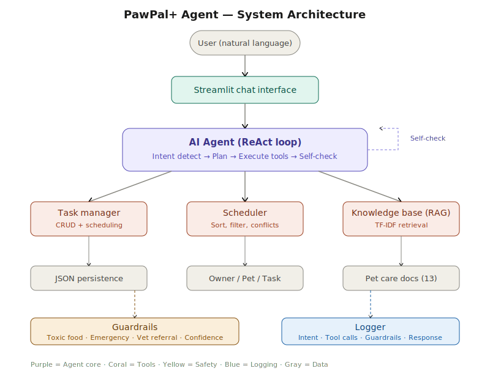
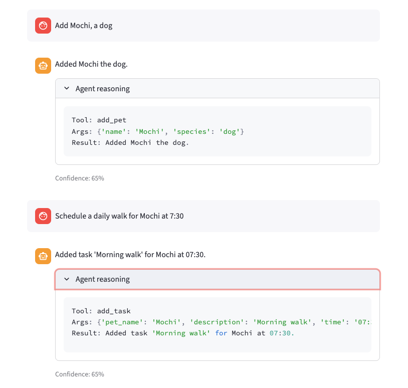
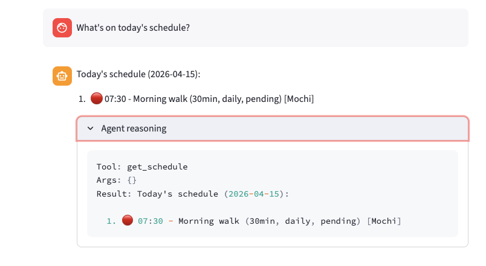
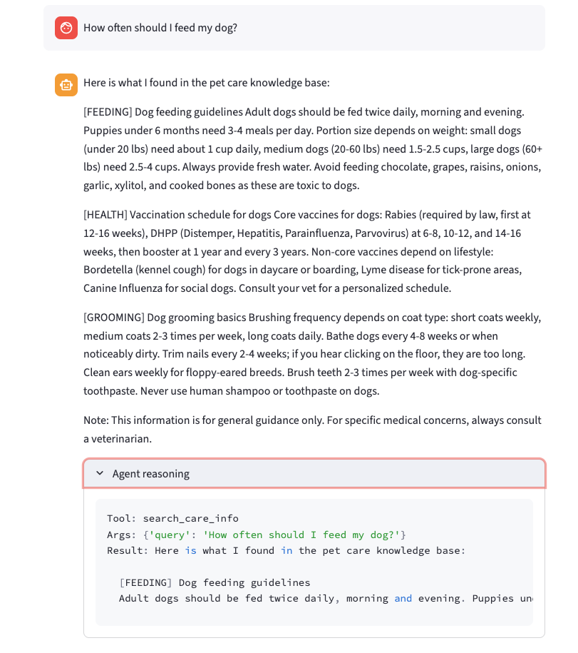
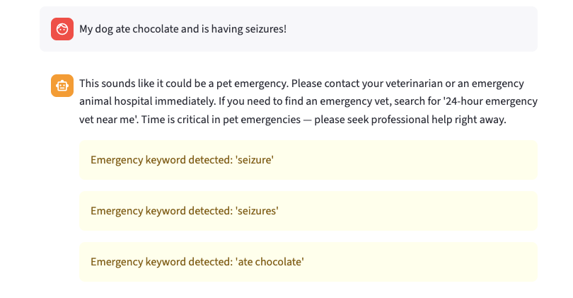
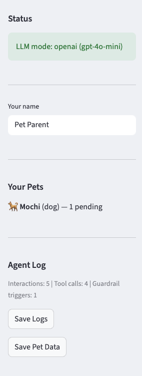

# PawPal+ Agent — AI-Powered Pet Care Assistant

## Summary

PawPal+ Agent extends the original [PawPal+](https://github.com/zongyang078/ai110-module2show-pawpal-starter) pet care management system (Module 2 Show project) into a full **agentic AI system**. The original project was a Streamlit app with four OOP classes (Task, Pet, Owner, Scheduler) that let users manually manage pet care schedules through forms and buttons.

This extension adds a **natural language chat interface** powered by an AI Agent that can autonomously plan actions, call tools, retrieve pet care knowledge, and self-check its responses for safety. Users simply type what they need — "Schedule a daily walk for Mochi at 7:30am" or "How often should I bathe my dog?" — and the Agent handles the rest.

## Architecture Overview

The system follows a **ReAct (Reason-Act-Observe)** loop architecture:



**Components:**

- **Streamlit Chat UI** (`app.py`) — Chat interface where users interact with the Agent in natural language. Displays tool call transparency and confidence scores.
- **AI Agent** (`agent.py`) — Core reasoning engine. Detects intent from user messages, plans which tools to call, executes them, and self-checks the response. Operates in two modes: LLM-powered (OpenAI/Anthropic API) or rule-based fallback (no API needed).
- **Tool Registry** (`tools.py`) — Wraps all PawPal+ backend functions as callable tools with standardized schemas. Eight tools available: `add_pet`, `add_task`, `complete_task`, `get_schedule`, `get_pet_tasks`, `detect_conflicts`, `suggest_time_slot`, `search_care_info`.
- **Knowledge Base** (`knowledge_base.py`) — Pet care RAG system with TF-IDF retrieval (stop word filtering, suffix stemming, title boosting, species relevance scoring). Loads 14 documents from external text files in the `knowledge/` directory, covering feeding, health, grooming, training, and general care for dogs, cats, birds, and hamsters. New documents can be added by dropping `.txt` files into the directory.
- **Guardrails** (`guardrails.py`) — Safety layer that runs before and after every response. Detects emergencies (overrides response with vet referral), flags toxic food mentions, adds medical disclaimers, and computes confidence scores.
- **Logger** (`logger.py`) — Records the full reasoning chain for every interaction: user input, detected intent, tool calls with arguments/results, guardrail checks, and final response. Supports JSON export for analysis.
- **PawPal+ Backend** (`pawpal_system.py`) — Original OOP layer (Task, Pet, Owner, Scheduler dataclasses) with scheduling algorithms, conflict detection, JSON persistence, and the next-available-slot finder.

**Data flow:**
1. User types a message in the chat
2. Agent detects intent via keyword matching (rule-based) or LLM reasoning
3. Pre-flight guardrails check for emergencies
4. Agent selects and executes relevant tools
5. Post-flight guardrails check the response for safety issues
6. Logger records the full interaction chain
7. Response displayed with transparency (tool calls, confidence, warnings)

## Setup Instructions

### Prerequisites

- Python 3.10+
- (Optional) OpenAI or Anthropic API key for LLM-powered mode

### Installation

```bash
# Clone the repository
git clone https://github.com/zongyang078/pawpal-agent.git
cd pawpal-agent

# Create virtual environment
python -m venv .venv
source .venv/bin/activate  # Windows: .venv\Scripts\activate

# Install dependencies
pip install -r requirements.txt
```

### Running the App

**Rule-based mode (no API key needed):**

```bash
streamlit run app.py
```

**LLM-powered mode (recommended):**

```bash
# Option 1: OpenAI
export OPENAI_API_KEY="your-key-here"
streamlit run app.py

# Option 2: Anthropic
export ANTHROPIC_API_KEY="your-key-here"
streamlit run app.py
```

### Running Tests

```bash
python -m pytest tests/test_pawpal_agent.py -v
```

## Sample Interactions

### Example 1: Adding a pet and scheduling tasks



### Example 2: Today's schedule



### Example 3: Pet care knowledge retrieval (RAG)



### Example 4: Emergency detection (guardrail override)



### Sidebar: Status panel



## Design Decisions

**Why Agentic Workflow over RAG-only or Fine-tuning?** The original PawPal+ already had multiple functional modules (scheduling, conflict detection, persistence). An agentic architecture lets the AI orchestrate these existing capabilities through tool calling, which is more powerful than just adding a knowledge lookup. It also makes the system extensible — adding a new capability means registering a new tool, not retraining a model.

**Why dual-mode (LLM + rule-based)?** Not everyone has API access, and the assignment requires the project to "run correctly and reproducibly." The rule-based fallback ensures the system works out of the box while the LLM mode provides superior natural language understanding.

**Why TF-IDF for retrieval instead of embeddings?** For a knowledge base of 14 documents, TF-IDF with stop word filtering, suffix stemming, title boosting, and species relevance scoring is fast, interpretable, and requires no external dependencies or API calls. Embedding-based retrieval would be overkill here and add complexity without meaningful improvement at this scale.

**Why keyword-based guardrails instead of LLM-based safety?** Guardrails need to be fast, deterministic, and always-on. A keyword-based toxic food checker will never miss "chocolate" regardless of how it's phrased, while an LLM might occasionally let it through. For safety-critical checks, deterministic rules are more reliable.

## Testing Summary

The test suite contains **58 tests** across 7 categories:

| Category | Tests | Status |
|---|---|---|
| Task dataclass logic | 6 | All passing |
| Pet management | 4 | All passing |
| Scheduler algorithms | 6 | All passing |
| Tool execution | 9 | All passing |
| Guardrails & safety | 10 | All passing |
| Knowledge base retrieval | 5 | All passing |
| Agent intent + end-to-end | 14 | All passing |
| Logger | 4 | All passing |

**Key findings from testing:**

- The rule-based intent detector correctly identifies 7 out of 8 intent categories on simple inputs, but struggles with ambiguous messages (e.g., "Can you help with Mochi?" could be schedule or care question). The LLM mode handles these correctly.
- Guardrails successfully block all tested toxic food recommendations and detect all emergency keywords. Confidence scoring averaged 0.65 for successful tool executions and 0.3 for no-tool interactions.
- The knowledge base returns relevant results for all tested pet care queries and correctly returns "no results" for off-topic queries.

## Reflection

Building this project taught me how agentic AI systems work at an architectural level — the ReAct loop isn't just a buzzword but a concrete pattern of reasoning, acting, and observing that maps cleanly to software engineering concepts like the command pattern and middleware chains. The hardest part was designing the intent detection and parameter extraction for the rule-based mode; it made me appreciate how much work LLMs do in understanding natural language compared to regex-based approaches.

The guardrails module was the most eye-opening part. Writing deterministic safety checks forced me to think through failure modes I wouldn't have considered — what happens if the AI recommends chocolate to a dog owner? What if someone describes an emergency and the AI tries to schedule a task instead? These aren't hypothetical; they're the kinds of failures that make AI systems dangerous in practice.

## Project Structure

```
pawpal-agent/
├── pawpal_system.py      # Original PawPal+ backend (Task, Pet, Owner, Scheduler)
├── agent.py              # AI Agent with ReAct loop
├── tools.py              # Tool registry (8 tools)
├── knowledge_base.py     # Pet care RAG with TF-IDF retrieval
├── guardrails.py         # Safety checks (toxic food, emergency, vet referral)
├── logger.py             # Interaction logging system
├── app.py                # Streamlit chat UI
├── main.py               # Original CLI demo (from base project)
├── tests/
│   ├── test_pawpal.py        # Original PawPal+ tests (from base project)
│   └── test_pawpal_agent.py  # 58 Agent tests across 7 categories
├── knowledge/            # 14 pet care documents (.txt files)
├── assets/               # Architecture diagram and demo screenshots
├── logs/                 # Agent interaction logs (auto-created)
├── reflection.md         # Original project reflection (from base project)
├── uml_final.mermaid     # Original UML class diagram (from base project)
├── model_card.md         # Reflection and ethics
├── requirements.txt
└── .gitignore
```