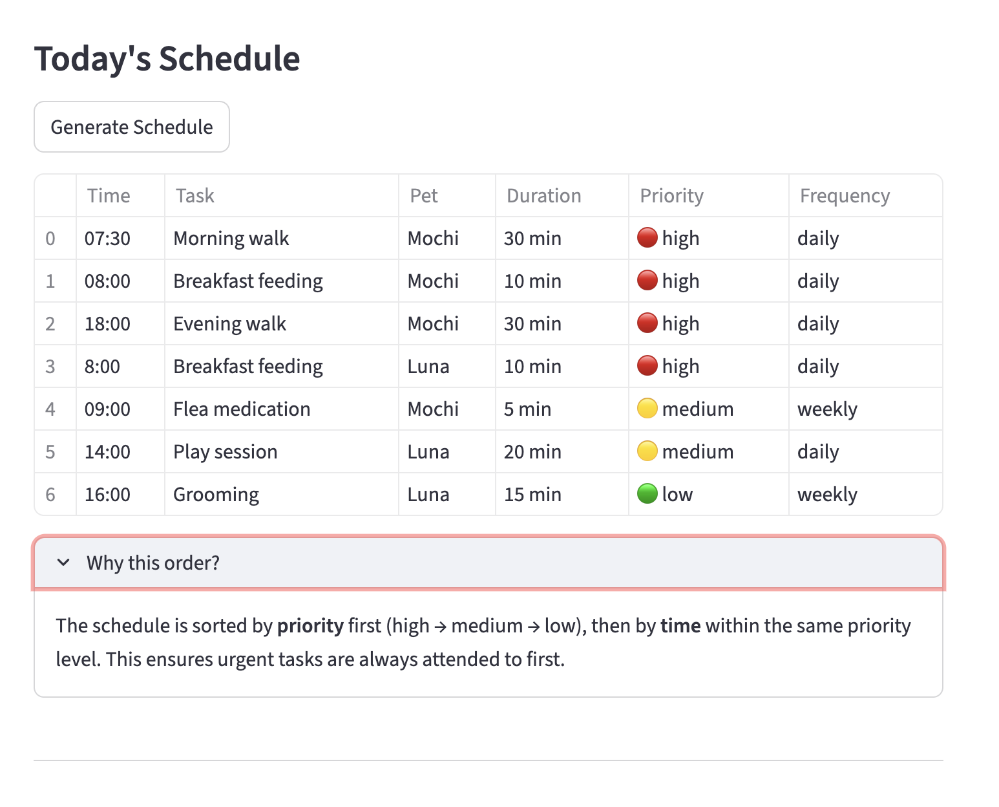

# PawPal+ (Module 2 Project)

**PawPal+** is a Streamlit-based pet care management system that helps pet owners plan and track daily care tasks for their pets.

## Scenario

A busy pet owner needs help staying consistent with pet care. They want an assistant that can:

- Track pet care tasks (walks, feeding, meds, enrichment, grooming, etc.)
- Consider constraints (time available, priority, owner preferences)
- Produce a daily plan and explain why it chose that plan

## Features

- **Owner & Pet Management**: Create an owner profile and add multiple pets with species info.
- **Task Scheduling**: Add tasks with time, duration, priority (high/medium/low), and frequency (once/daily/weekly).
- **Sorting by Time**: View all tasks sorted chronologically using Python's `sorted()` with a lambda key on "HH:MM" strings.
- **Sorting by Priority**: Tasks are ordered high → medium → low using a priority-weight mapping.
- **Filtering**: Filter tasks by pet name or completion status.
- **Conflict Warnings**: The scheduler detects when multiple tasks are scheduled at the same time and displays warnings.
- **Daily Recurrence**: When a daily or weekly task is marked complete, a new instance is automatically created for the next due date using `timedelta`.
- **Schedule Generation**: Produces a daily plan sorted by priority first, then by time, with a reasoning explanation.

## Smarter Scheduling

The `Scheduler` class acts as the system's "brain" with the following algorithmic features:

1. **Priority-then-time sorting**: Tasks are sorted by a numeric priority weight (`high=3, medium=2, low=1`) in descending order, with time as a secondary sort key. This ensures urgent tasks surface first while maintaining chronological order within the same priority.

2. **Conflict detection**: Groups pending tasks by time slot and flags any slot with 2+ tasks. This is a lightweight approach that checks exact time matches rather than overlapping durations — a reasonable tradeoff for a daily planner where most tasks are at fixed times.

3. **Recurring task automation**: When `mark_task_complete()` is called on a daily/weekly task, `create_next_occurrence()` uses `timedelta(days=1)` or `timedelta(days=7)` to generate the next instance and auto-adds it to the pet's task list.

4. **Next available slot finder** (Extension): `find_next_available_slot()` scans from 07:00 to 21:00 in 30-minute increments, converts HH:MM to minutes-since-midnight, and checks each candidate against all occupied time ranges using overlap detection (`candidate < occ_end and candidate_end > occ_start`). Unlike the basic conflict detection which only checks exact time matches, this algorithm is duration-aware — a 60-minute task at 08:00 correctly blocks the 08:30 slot. This was implemented using Agent Mode to coordinate changes across the Scheduler class and the Streamlit UI.

5. **JSON data persistence** (Extension): The Owner class has `save_to_json()` and `load_from_json()` class methods that serialize the entire object graph (Owner → Pets → Tasks) to a `data.json` file. Each class implements `to_dict()` and `from_dict()` for clean conversion. Dates use ISO format strings for JSON compatibility. The Streamlit app auto-loads saved data on startup and saves after every mutation (add pet, add task, complete task).

## System Architecture

The system uses four core classes following OOP principles with Python dataclasses:

- **Task**: Data model for a single care activity (description, time, duration, priority, frequency, status, due date).
- **Pet**: Holds pet info and manages a list of Task objects.
- **Owner**: Manages multiple Pet objects and aggregates tasks across all pets.
- **Scheduler**: The orchestration layer that sorts, filters, detects conflicts, and generates schedules by querying the Owner.

See `uml_final.mermaid` for the complete class diagram, or paste it into the [Mermaid Live Editor](https://mermaid.live/) to view.

## Getting Started

### Setup

```bash
python -m venv .venv
source .venv/bin/activate  # Windows: .venv\Scripts\activate
pip install -r requirements.txt
```

### Run the CLI Demo

```bash
python main.py
```

### Run the Streamlit App

```bash
streamlit run app.py
```

### Testing PawPal+

Run the automated test suite with:

```bash
python -m pytest tests/test_pawpal.py -v
```

The test suite covers:

- **Task completion**: Verifying `mark_complete()` changes status correctly.
- **Task addition**: Confirming adding tasks increases pet's task count and sets `pet_name`.
- **Sorting correctness**: Tasks are returned in chronological order after `sort_by_time()`.
- **Priority sorting**: High priority tasks come before low priority tasks.
- **Recurrence logic**: Completing a daily task creates a new task for the following day.
- **Conflict detection**: Scheduler flags duplicate time slots, no false positives on unique times.
- **Edge cases**: Empty pets, already-completed tasks, nonexistent removal targets.

**Confidence Level**: ⭐⭐⭐⭐ (4/5) — All core behaviors are tested. Additional edge cases to explore with more time: overlapping time ranges (not just exact matches), tasks spanning midnight, and extremely large task lists.

## 📸 Demo

 

## Project Structure

```
├── pawpal_system.py      # Backend logic layer (Task, Pet, Owner, Scheduler)
├── app.py                # Streamlit UI
├── main.py               # CLI demo script
├── tests/
│   └── test_pawpal.py    # Automated test suite
├── uml_final.mermaid     # Final UML class diagram
├── reflection.md         # Project reflection
├── requirements.txt      # Dependencies
└── README.md             # This file
```
