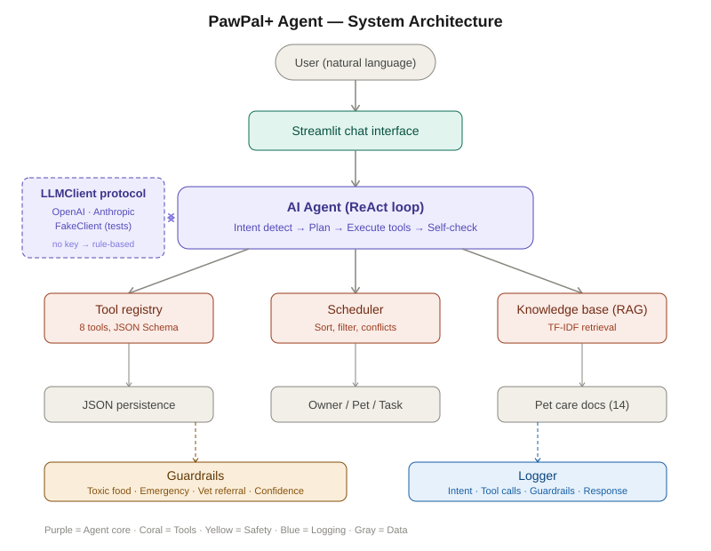
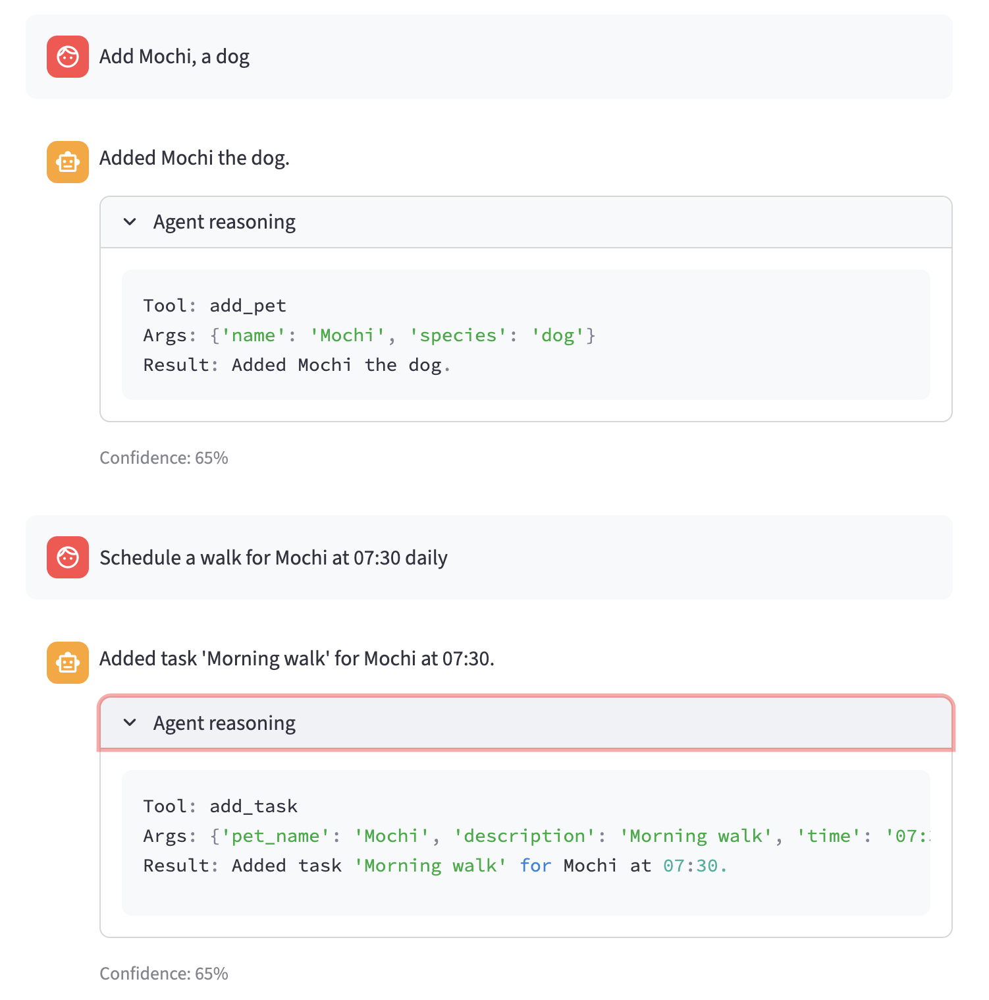
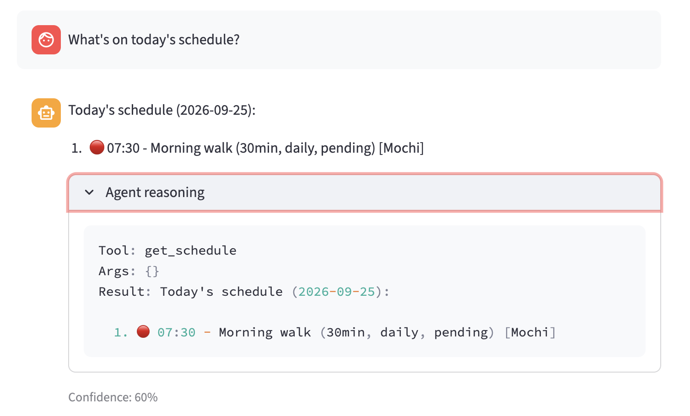
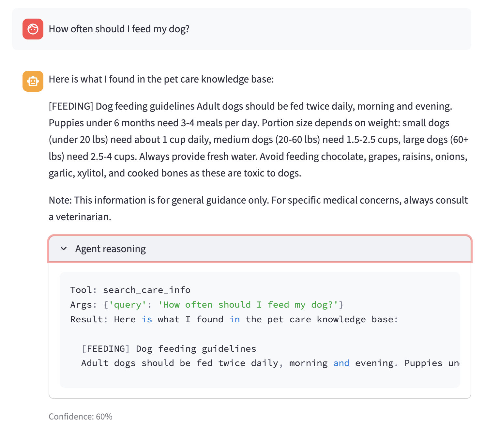
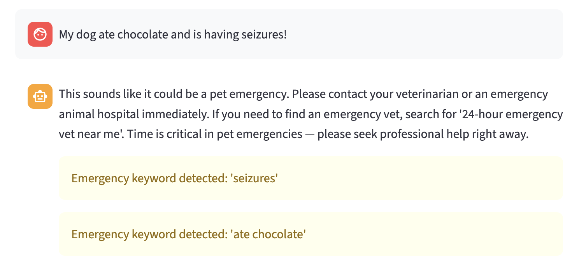

# PawPal+ Agent

A pet care scheduling assistant you talk to in plain language. It manages pets
and recurring care tasks, spots scheduling conflicts, finds open time slots, and
answers husbandry questions from a local knowledge base — with a deterministic
safety layer wrapped around every response.

```
$ python cli.py ask "Add Mochi, a dog"
Added Mochi the dog.

$ python cli.py ask "Schedule a walk for Mochi at 07:30 daily"
Added task 'Morning walk' for Mochi at 07:30.

$ python cli.py schedule
Today's schedule (2026-09-14):
  1. 🔴 07:30 - Morning walk (30min, daily, pending) [Mochi]

$ python cli.py ask --trace "How often should I bathe my dog?"
  trace:
    search_care_info({'query': 'How often should I bathe my dog?'})
    confidence: 0.70
Here is what I found in the pet care knowledge base:

  [GROOMING] Dog grooming basics
  Brushing frequency depends on coat type: short coats weekly [...]

$ python cli.py ask "My dog is not breathing!"
  ! Emergency keyword detected: 'not breathing'
This sounds like it could be a pet emergency. Please contact your
veterinarian or an emergency animal hospital immediately. [...]
```

## Architecture



The agent is an orchestration layer over its own tools. A turn runs as:
intent detection → pre-flight guardrails → tool planning and execution →
post-flight guardrails → confidence scoring → logging.

| Module | Role |
|---|---|
| [`agent.py`](agent.py) | Reasoning loop. Plans and executes tools, self-checks the result. Two modes: LLM function calling, or keyword dispatch when no API key is set. |
| [`llm.py`](llm.py) | Provider abstraction. One neutral transcript protocol, one adapter per vendor, plus `FakeClient` for tests. The loop in `agent.py` is provider-agnostic. |
| [`tools.py`](tools.py) | Eight tools as JSON Schema function definitions: `add_pet`, `add_task`, `complete_task`, `get_schedule`, `get_pet_tasks`, `detect_conflicts`, `suggest_time_slot`, `search_care_info`. |
| [`knowledge_base.py`](knowledge_base.py) | Retrieval over 14 documents in [`knowledge/`](knowledge/). Hand-rolled TF-IDF with stop words, suffix stemming, 3× title boost, and species weighting. Drop in a `.txt` file to extend it. |
| [`guardrails.py`](guardrails.py) | Safety checks before and after each response: emergency override, medical disclaimer, toxic food scan, confidence score. |
| [`logger.py`](logger.py) | Records the full chain per interaction — input, intent, tool calls with arguments and results, guardrail outcome, response. Exports to JSON. |
| [`pawpal_system.py`](pawpal_system.py) | Domain layer: `Task`, `Pet`, `Owner`, `Scheduler`. Priority scheduling, recurrence, conflict detection, duration-aware slot finding, JSON persistence. |
| [`cli.py`](cli.py) | Terminal entry point. |
| [`app.py`](app.py) | Streamlit chat UI, with tool-call and confidence transparency. |

The LLM layer targets OpenAI (`gpt-4o-mini`) and Anthropic
(`claude-sonnet-4-20250514`) through their native tool-calling APIs. Both are
optional: with no key configured the agent runs entirely on keyword dispatch, so
the system works offline and the test suite never touches the network.

Providers sit behind a single `LLMClient` protocol — the loop hands over a
neutral transcript and gets back text or tool calls, and each adapter owns the
translation to its vendor's wire format. Adding a third provider is one adapter,
not a second copy of the loop. `PawPalAgent` accepts an injected client, which
is how the loop gets tested without a network:

```python
agent = PawPalAgent(owner=owner, llm_client=FakeClient([
    LLMResponse(tool_calls=[ToolCall(id="c1", name="add_pet",
                                     arguments={"name": "Mochi", "species": "dog"})]),
    LLMResponse(text="Added Mochi."),
]))
```

## Quickstart

```bash
python -m venv .venv && source .venv/bin/activate
pip install -r requirements.txt
```

Optionally export `OPENAI_API_KEY` or `ANTHROPIC_API_KEY` to enable LLM mode.

```bash
python cli.py seed                    # write a sample owner, 2 pets, 6 tasks
python cli.py schedule                # today's plan, plus any conflicts
python cli.py pets                    # registered pets and pending counts
python cli.py ask "..." [--trace]     # one question, optionally with the tool trace
python cli.py chat [--trace]          # interactive session
python cli.py --data demo.json ...    # use a different state file

streamlit run app.py                  # chat UI
```

## Testing

```bash
python -m pytest tests/ -q
```

182 tests across 9 modules, no network access required:

| Module | Tests | Under test |
|---|---|---|
| [`test_agent.py`](tests/test_agent.py) | 34 | Intent detection, ReAct loop, guardrail regressions, degradation |
| [`test_domain.py`](tests/test_domain.py) | 33 | Task, Pet, Owner, Scheduler, slot finder, persistence |
| [`test_evals.py`](tests/test_evals.py) | 29 | Metric arithmetic, dataset integrity, harness CLI |
| [`test_llm.py`](tests/test_llm.py) | 20 | Adapter translation both ways, error mapping, client construction |
| [`test_guardrails.py`](tests/test_guardrails.py) | 17 | Toxic food, emergency, referral, confidence |
| [`test_knowledge_base.py`](tests/test_knowledge_base.py) | 16 | Retrieval, ranking, IDF weighting, corpus loading |
| [`test_tools.py`](tests/test_tools.py) | 14 | Tool schemas and dispatch |
| [`test_cli.py`](tests/test_cli.py) | 11 | Every subcommand, exit codes, stream routing |
| [`test_logger.py`](tests/test_logger.py) | 8 | Recording, summary, JSON export |

Line coverage is 83%:

```
evals/metrics.py  100%    guardrails.py      99%    pawpal_system.py   98%
knowledge_base.py  96%    llm.py             94%    logger.py          88%
evals/run.py       87%    tools.py           84%    cli.py             83%
agent.py           74%    app.py              0%
```

The ReAct loop is covered against `FakeClient`: multi-step tool chains, parallel
calls in one reply, the iteration cap, tool failures coming back as
observations, and the fallback to rule-based mode when a provider raises. What
remains uncovered in `agent.py` is the rule-based parameter extraction — the
`_extract_*` and `_guess_*` helpers, which is also where its remaining defects
live (see Still outstanding).

## Evaluation

```bash
python -m evals.run                 # all suites
python -m evals.run --show-errors   # every failing case
python -m evals.run --fail-under 0.9
```

121 labelled cases, run offline against the rule-based path — no API key, no
network, reproducible:

| Suite | Metric | Score | n |
|---|---|---|---|
| Intent detection | accuracy | 68.0% | 50 |
| Retrieval | recall@1 / recall@3 / MRR | 90.0% / 93.3% / 0.917 | 30 |
| Guardrail: emergency | recall / FPR | 100% / 0% | 18 |
| Guardrail: vet referral | recall / FPR | 100% / 0% | 11 |
| Guardrail: toxic food | recall / FPR | 100% / 0% | 12 |

**The first run failed badly, which was the point.** Emergency recall was 63.6%
and retrieval recall@1 was 56.7%. Three diagnoses followed:

- *Phrases were matched rigidly.* "hit by car" missed "he was hit by **a**
  car"; "blood in stool" missed "blood in **my cat's** stool". Keyword terms
  now allow a bounded gap between them.
- *Single words were too broad.* "heart" fired on "my dog has a big heart",
  "collapsed" on "collapsed onto the couch for a nap" — the same failure as
  "swallowed". Both now require medical or non-benign context.
- *Retrieval was ranking on the species word.* For "my dog has been vomiting
  for two days", the word "dog" alone supplied 62% of the score of "Dog feeding
  guidelines", which beat the health article that actually contains "vomiting".
  Species is already applied as a multiplier, so counting it in the term sum
  double-counted it. Excluding species terms took recall@1 from 56.7% to 90.0%
  and MRR from 0.661 to 0.917.

**Read the guardrail scores with suspicion.** They were tuned against these
same 41 cases, so 100% is a statement about this set, not about English. The
number worth trusting is the direction of the change and the class of bug it
caught. A held-out set is the obvious next step.

**Intent detection at 68% is the honest weak spot**, and it is left unfixed.
`detect_conflicts` recall is 25%; `general_chat` precision is 38.5% because
unmatched utterances fall through to it; "schedule" appears in both the
`add_task` and `get_schedule` keyword lists, so the two collide. This only
affects the no-API-key path — in LLM mode the model selects tools directly —
which is why the effort went to the safety layer first.

Retrieval's two remaining misses are vocabulary gaps, not ranking bugs: "what
shots does my puppy need" fails because the corpus says "vaccines", and "what
should I feed my parrot" because the bird article never uses the word "feed".
That is the ceiling of lexical matching, and it is where embeddings would
actually earn their cost.

## Design decisions

**Agentic orchestration over RAG-only.** The scheduling backend already had
real capabilities — priority sorting, recurrence, conflict detection, slot
finding. Wrapping those as tools lets the model compose them, and adding a
capability means registering a tool rather than changing a prompt. A
retrieval-only design could answer questions but could not *do* anything.

**Dual mode, LLM and rule-based.** The fallback is not a toy: it handles the
eight intent categories directly, which makes the system runnable with no
credentials and makes the whole test suite hermetic. It buys reproducibility at
the cost of recall on indirect phrasing — a trade-off that shows up plainly in
the model card's limitations.

**TF-IDF over embeddings.** At 14 documents, a scored keyword match with title
boosting and species weighting is fast, interpretable, and dependency-free. The
honest version of this decision: it is right at this corpus size and would be
wrong at 10× it, where the lack of chunking and vector scoring would start to
cost real accuracy.

**Keyword guardrails over an LLM judge.** Safety checks should be fast,
always-on, and identical every time. A table lookup for "chocolate" cannot be
prompted out of firing. The cost is brittleness at the edges, and the defects
below are exactly that cost showing up.

## Defects found and fixed

Restructuring the test suite surfaced four defects, three of them in the safety
layer. Each now has a regression test named after the failure it prevents.

1. **A medical keyword suppressed the answer entirely.** The pre-flight check
   ran the whole guardrail pipeline against an empty response string, so a
   vet-referral keyword made the modified response non-empty and the agent read
   it as an emergency override. "My dog has a lump, how often should I feed
   him?" returned the disclaimer and nothing else, at a reported confidence of
   1.0. The pre-flight stage now runs only the emergency check — the one check
   that should stop a turn before any tool does work.

2. **Keyword tables matched bare substrings.** "plump" contains "lump", so a
   hamster weight question read as a possible tumour. All three tables are now
   anchored on word boundaries.

3. **The toxic food check could be talked out of firing.** Its context window
   counted the words "not" and "safe" as evidence that a warning was already
   present, so "Chocolate is a safe treat for your dog" passed clean. Warning
   language is now an explicit pattern, and *every* mention of a toxic item has
   to carry its own warning — warning once at the top of a long retrieval answer
   no longer licenses an unwarned mention further down.

4. **Retrieval was dead on small corpora.** IDF was `log(N / (1 + df))`, which
   is ≤ 0 once a term appears in nearly every document, and `search()` drops
   anything scoring ≤ 0 — so a corpus of one or two documents could never
   return a hit. Now smoothed to `log((1 + N) / (1 + df)) + 1`. The earlier
   suite missed this because it only ever exercised the full 14-document corpus.

Defect 2 also exposed the ceiling of keyword matching: "swallowed" is what a dog
does at every meal, so no amount of boundary anchoring fixes "swallowed his food
quickly". That keyword now carries a negative lookahead for ordinary food, which
is about as much nuance as a keyword table can express.

## Still outstanding

**Intent detection sits at 68%** and the guardrail suites have no held-out
split — see Evaluation.

Also: tool results are returned as strings, so the agent cannot branch on
failure programmatically; no timeouts, retries, or cost ceilings on provider
calls; magic numbers in place of configuration; and the rule-based parameter
extraction is weak — `_extract_pet_info("Yesterday I adopted a dog, Rex")`
returns "Yesterday" as the name, because it takes the first capitalised word.

## Screenshots

| | |
|---|---|
|  |  |
|  |  |

## Project structure

```
pawpal-agent/
├── agent.py              # reasoning loop, intent detection
├── llm.py                # provider adapters + test double
├── tools.py              # tool schemas and dispatch
├── knowledge_base.py     # TF-IDF retrieval
├── guardrails.py         # safety checks
├── logger.py             # interaction logging
├── pawpal_system.py      # domain layer
├── cli.py                # terminal entry point
├── app.py                # Streamlit chat UI
├── knowledge/            # 14 care documents (.txt)
├── evals/                # labelled datasets, metrics, harness
├── tests/                # 182 tests across 9 modules
├── assets/               # architecture diagram, screenshots
├── model_card.md         # intended use, limitations, safety gaps
└── requirements.txt
```

## Origins

Built on a course starter project — a Streamlit CRUD app with four OOP classes,
roughly 200 lines. Everything after that (agent, tools, retrieval, guardrails,
logging, CLI, tests) was added on top. Commit history preserves the attribution.
